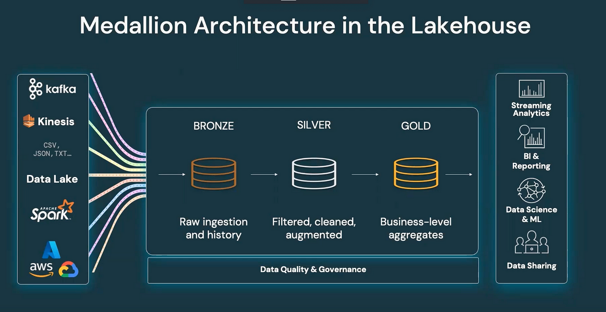
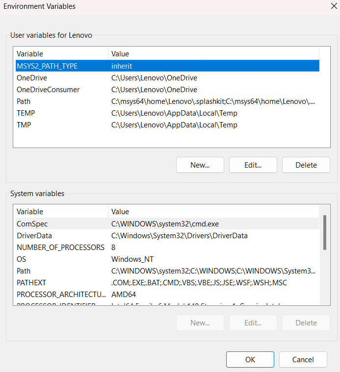

# Part 2, Session 9 - Azure Storage

<br><br>
There's a lot of content in this session!
<br><br>

## What is Azure Storage?

- [Azure Storage](https://learn.microsoft.com/en-us/azure/storage/common/storage-introduction)
- It's a **PaaS** service, (Platform as a Service)
- Think of it as an infinite **cloud-based filesystem**
- High Availability
- Lowest Cost Storage Option compared to Databases
- Optional Replication - Zone or Regional
  - Duplicate copies of the data in different locations 
  - [List of Azure Regions](https://learn.microsoft.com/en-us/azure/reliability/regions-list)
  - [Azure Regions Map](https://learn.microsoft.com/en-us/azure/networking/microsoft-global-network)
- Store any filetype
  - Files are called **blobs** (Binary Large Objects)
  - Current customer project example: PDF, Word, HTML, images, Markdown, JSON
- The **blobs** can contain optional **metadata** attributes
  - For example, the email address of who uploaded the file
  - For example, some correlation ID or other unique identifier
- Azure Storage is well integrated with other Azure services 
  - Azure Functions can be triggered by new blob events 
    - Supports an **event-driven** architecture
    - Azure Functions are small/lightweight programs 
    - This architecture is called **serverless**, because the cloud provider manages the infrastructure
  - Azure Logic Apps can be triggered by new blob events 
  - Azure Search can ingest the blob data 

### Wait, what's a PaaS service?

> Platform as a Service (PaaS) is a cloud computing model that provides a turnkey,
> virtualized environment for developers to build, deploy, and manage applications
> over a network (public or private). 

In short:
- You can't access the underlying infrastructure - virtual machines, disks, etc
- You specify the location, type, scale (throughput), and configuration - the cloud provider does the rest
- You access the service via an API or SDK, via networking endpoints and keys/credentials
  - Keys or Identities or RBAC (Role Based Access Control) are used for authentication and authorization


<br><br><br>
---
<br><br><br>

## Medallion Architecture

- A storage architecture with **Bronze** (raw), **Silver**, and **Gold** layers
- The **Bronze** layer is the **raw** layer where the data is stored in its original form
- The **Silver** layer is a working layer where the data is refined and augmented
- The **Gold** layer is the refined data for business application use

<p align="center">
   
</p>

Image Source: https://www.lakehousepartners.ai/post/medallion-structure 

<br><br><br>
---
<br><br><br>

## Azure PaaS Service Authentication and Authorization - Keys or Identities

- [Read and Write Keys](https://learn.microsoft.com/en-us/azure/storage/common/storage-account-keys-manage)
- Or [Managed Identities](https://learn.microsoft.com/en-us/entra/identity/managed-identities-azure-resources/overview)
- This series uses **keys** - I provide the read-only keys for your use
  - In the form of an **.env** file that python can read with the [python-dotenv](https://pypi.org/project/dotenv-python/) library
  - You can uses these **only for this series and NOT your personal projects**

<br><br><br>
---
<br><br><br>

## Environment Variables  

- **Environment variables are named configuration values stored outside application code but within the computer operating system.**
- They are typically used for URLs, secrets, passwords, API keys, etc.
- **This is an important concept - we'll be using environment variables for the rest of this series.**

### Environment Variables on Windows 11

See https://learn.microsoft.com/en-us/answers/questions/4330946/change-system-variables-on-windows-11

<p align="center">
  
</p>

### How this works in the python code 

- Python code can read the system and user environment variables on the host computer
- But you have to manually set each in the above UI on Windows 11
- It's simpler to just use a **.env** file in the python directory, which is read by the **python-dotenv** library
- Important note 1: 
  - The .env file should **NOT** be stored in source control (because it contains secrets)
  - The .gitignore file is a file that tells git to ignore certain files and directories
  - See the **/.env** entry in the **.gitignore** file for the repo
- Important note 2:
  - A .env file will be provided for you in the zero-to-AI Teams channel 
  - **THIS IS PROVIDED FOR YOUR USE ONLY FOR THIS SERIES AND NOT FOR YOUR PERSONAL PROJECTS**

#### Sample .env File

Format is KEY="VALUE"

```
AZURE_STORAGE_ACCOUNT="xxx"
AZURE_STORAGE_KEY="yyy"
AZURE_STORAGE_CONN_STRING="zzz"
```

#### pyproject.toml file 

```
...
dependencies = [
  ...
  "python-dotenv>=1.2.1"
  ...
]
...
```

```
import os
from dotenv import load_dotenv

if __name__ == "__main__":  # this is the entry point for the CLI program
    try:
        load_dotenv(override=True)                     # load the .env file into the environment
        print(os.getenv("AZURE_STORAGE_CONN_STRING"))  # get and display the connection string
        ...
    except Exception as e:
        print(str(e))  # print the error message
        print(traceback.format_exc())  # print the traceback, or stack trace
```

### Class Env in this codebase 

- See file **python/src/os/env.py**
- It contains methods that return the necessary environment variables for this app


<br><br><br>
---
<br><br><br>

## Azure Storage Explorer

- [Download](https://azure.microsoft.com/en-us/products/storage/storage-explorer)
- It's like Windows Explorer, or the macOS Finder app, but for Azure Storage
  - Drag, drop, upload, download, etc.

<p align="center">
   
</p>


<br><br><br>
---
<br><br><br>

## Azure Storage with Python

- Use the [azure-storage-blob @ PyPI](https://pypi.org/project/azure-storage-blob/) library, from Microsoft

<br><br><br>

## Reusable Code in this GitHub Repository

- See the **python/src** directory
- See reusable class **StorageUtil** in file python/src/io/storage_util.py for **Azure Storage** operations
- See reusable class **FS** in file python/src/io/fs.py for **local filesystem** operations
- This code is used throughout this series 
- **It's also intended for your future use - copy it, use it, learn from it, modify it as needed**

<br><br><br>

## Asynchronous Code in Python

- Wait, why are we learning about asynchronous code now?
  - Because the Azure Storage SDK and most AI SDKs are asynchronous
- It enables your code to execute several tasks concurrently and efficiently
  - For example, as a program waits for a HTTP response, it can do other work in the meantime
- [asyncio @ PyPI](https://docs.python.org/3/library/asyncio.html)
- **asyncio** is a library to write concurrent code using the **async/await** syntax
- See file **async-poem.py** - a simple example of asynchronous code
  - It uses the **async** and **await** keywords

```
$ python async-poem.py cats

Roses are red
Violets are blue
I feel green
When I'm not with you

Oh, I forgot to include cats in this poem!
```

async-poem.py looks like the following, note the **async** and **await** keywords:

```
...

async def write_me_a_poem(subject: str) -> str:
    # simulate async behavior with the asyncio.sleep(seconds) method
    await asyncio.sleep(0.01)

    color = random.choice(["blue", "green", "gray"])
    lines = list()
    lines.append("Roses are red")
    lines.append("Violets are blue")
    lines.append(f"I feel {color}")
    lines.append("When I'm not with you")
    lines.append("")
    lines.append(f"Oh, I forgot to include {subject} in this poem!")
    return "\n".join(lines)

async def main():
    poem = await write_me_a_poem(sys.argv[1])
    print(poem)

if __name__ == "__main__":
    asyncio.run(main())
```

<br><br><br>
---
<br><br><br>

## Demonstration - create container, upload, download

- File main-storage.py
- It uses the above reusable class StorageUtil

```
$ python main-storage.py execute_examples 5

ERROR:root:App#initialize - load_dotenv starting
ERROR:root:App#initialize - load_dotenv completed
WARNING:root:System#set_event_loop_policy - Not running on Windows

===== StorageUtil constructor

===== initial listing, and deletion of execute_examples containers
Current storage containers: ['execute-examples-1772655081']
Deleting container: execute-examples-1772655081
Container 'execute-examples-1772655081' deleted successfully.

===== creating a new container named: execute-examples-1772831186
Container 'execute-examples-1772831186' created successfully.

===== uploading pyproject.toml, with optional metadata attributes
pyproject.toml has 107 lines
Upload result: True

===== uploading data/stdlib.json
Upload result: True

===== list containers again
Containers: ['execute-examples-1772831186']
WARNING:root:file written: tmp/storage-containers.json

===== list container, blob names only
Blobs in 'execute-examples-1772831186': ['data/stdlib.json', 'pyproject.toml']
WARNING:root:file written: tmp/storage-blobs.json

===== download_blob_to_file: pyproject.toml -> tmp/pyproject_downloaded.toml
Download result: (True, {'name': 'pyproject.toml', 'container': 'execute-examples-1772831186', 'snapshot': None, 'version_id': None, 'is_current_version': None, 'blob_type': <BlobType.BLOCKBLOB: 'BlockBlob'>, 'metadata': {'description': 'pyproject.toml file for the zero-to-AI project', 'line_count': '107'}, 'encrypted_metadata': None, 'last_modified': datetime.datetime(2026, 3, 6, 21, 6, 31, tzinfo=datetime.timezone.utc), 'etag': '"0x8DE7BC43DABBA5A"', 'size': 2768, 'content_range': None, 'append_blob_committed_block_count': None, 'is_append_blob_sealed': None, 'page_blob_sequence_number': None, 'server_encrypted': True, 'copy': {'id': None, 'source': None, 'status': None, 'progress': None, 'completion_time': None, 'status_description': None, 'incremental_copy': None, 'destination_snapshot': None}, 'content_settings': {'content_type': 'application/octet-stream', 'content_encoding': None, 'content_language': None, 'content_md5': bytearray(b'\xb4+\xf3(S\x82\xcaWRF\xab\xcf\xf38\x13\x8d'), 'content_disposition': None, 'cache_control': None}, 'lease': {'status': 'unlocked', 'state': 'available', 'duration': None}, 'blob_tier': 'Hot', 'rehydrate_priority': None, 'blob_tier_change_time': None, 'blob_tier_inferred': True, 'deleted': False, 'deleted_time': None, 'remaining_retention_days': None, 'creation_time': datetime.datetime(2026, 3, 6, 21, 6, 31, tzinfo=datetime.timezone.utc), 'archive_status': None, 'encryption_key_sha256': None, 'encryption_scope': None, 'request_server_encrypted': True, 'object_replication_source_properties': [], 'object_replication_destination_policy': None, 'last_accessed_on': None, 'tag_count': None, 'tags': None, 'immutability_policy': {'expiry_time': None, 'policy_mode': None}, 'has_legal_hold': None, 'has_versions_only': None})
Download result metadata: {'description': 'pyproject.toml file for the zero-to-AI project', 'line_count': '107'}

===== download_blob_to_file: data/stdlib.json -> tmp/stdlib.json
Download result: (True, {'name': 'data/stdlib.json', 'container': 'execute-examples-1772831186', 'snapshot': None, 'version_id': None, 'is_current_version': None, 'blob_type': <BlobType.BLOCKBLOB: 'BlockBlob'>, 'metadata': {}, 'encrypted_metadata': None, 'last_modified': datetime.datetime(2026, 3, 6, 21, 6, 36, tzinfo=datetime.timezone.utc), 'etag': '"0x8DE7BC440B1EFA0"', 'size': 4041, 'content_range': None, 'append_blob_committed_block_count': None, 'is_append_blob_sealed': None, 'page_blob_sequence_number': None, 'server_encrypted': True, 'copy': {'id': None, 'source': None, 'status': None, 'progress': None, 'completion_time': None, 'status_description': None, 'incremental_copy': None, 'destination_snapshot': None}, 'content_settings': {'content_type': 'application/octet-stream', 'content_encoding': None, 'content_language': None, 'content_md5': bytearray(b'\x7f\xf6,\x9c2\xe0?\x0b+\x04\xd2\xbc\xa8\xe5\xca;'), 'content_disposition': None, 'cache_control': None}, 'lease': {'status': 'unlocked', 'state': 'available', 'duration': None}, 'blob_tier': 'Hot', 'rehydrate_priority': None, 'blob_tier_change_time': None, 'blob_tier_inferred': True, 'deleted': False, 'deleted_time': None, 'remaining_retention_days': None, 'creation_time': datetime.datetime(2026, 3, 6, 21, 6, 36, tzinfo=datetime.timezone.utc), 'archive_status': None, 'encryption_key_sha256': None, 'encryption_scope': None, 'request_server_encrypted': True, 'object_replication_source_properties': [], 'object_replication_destination_policy': None, 'last_accessed_on': None, 'tag_count': None, 'tags': None, 'immutability_policy': {'expiry_time': None, 'policy_mode': None}, 'has_legal_hold': None, 'has_versions_only': None})

===== parse the downloaded pyproject file with tomllib.load()
project name: zero-to-AI
project version: 1.0.0
project description: The 'zero-to-AI' series of lessons at 3Cloud/Cognizant
project dependencies: ['agent-framework', 'aiohttp>=3.11.18', 'alembic>=1.17.0', 'av==16.0.1', 'azure-ai-agents>=1.2.0b3', 'azure-ai-documentintelligence==1.0.2', 'azure-ai-evaluation', 'azure-ai-projects', 'azure-ai-textanalytics', 'azure-core-tracing-opentelemetry', 'azure-core==1.36.0', 'azure-cosmos>=4.14.5', 'azure-identity', 'azure-keyvault-secrets>=4.10.0', 'azure-mgmt-applicationinsights', 'azure-mgmt-cognitiveservices', 'azure-search-documents==11.5.2', 'azure-storage-blob>=12.27.0', 'beautifulsoup4>=4.14.2', 'docopt', 'duckdb>=1.4.3', 'Faker', 'fastapi[standard]', 'fastmcp>=2.13.0', 'geopy', 'h11>=0.14.0', 'httpx', 'httpx[cli]>=0.28.1', 'Jinja2>= 3.1.4', 'jupyter>=1.1.1', 'm26>=0.3.2', 'markdown>=3.1.0', 'matplotlib>=3.10.0', 'openai>=1.96.0', 'opentelemetry-api==1.38.0', 'opentelemetry-exporter-otlp-proto-grpc==1.38.0', 'opentelemetry-instrumentation-httpx==0.59b0', 'opentelemetry-instrumentation-logging==0.59b0', 'opentelemetry-instrumentation-psycopg2==0.59b0', 'opentelemetry-instrumentation-requests==0.59b0', 'opentelemetry-sdk==1.38.0', 'pandas>=2.3.0', 'pgvector>=0.4.1', 'polars>=1.37.0', 'psutil>=7.1.1', 'psycopg2-binary>=2.9.11', 'pydantic-core>=2.41.0', 'pydantic>=2.12.0', 'pylint>=4.0.4', 'pytest-asyncio>=1.0.0', 'pytest-cov>=6.1.1', 'pytest-randomly>=4.0.0', 'pytest>= 8.3.5', 'python-dotenv>=1.2.1', 'python-json-logger>=4.0.0', 'python-multipart>=0.0.20', 'pytz', 'rdflib>=7.5.0', 'six==1.17.0', 'sqlalchemy_utils', 'SQLAlchemy>=2.0.44', 'streamlit>=1.52.2', 'tenacity>=9.1.2', 'tiktoken>=0.12.0', 'python-toon', 'uvicorn==0.38.0', 'watchdog']
WARNING:root:file written: tmp/pyproject_downloaded.json
```

<br><br><br>

# Homework 

- Learn how to set user environment variables on your computer
  - See https://www.youtube.com/watch?v=Z2k7ZBMZT3Y
- Learn now to use the .env file 
  - Copy dotenv-example.txt to .env in the python directory
  - Run: python main-storage.py check_env
    - See the output 
  - Edit the .env file, change the AZURE_STORAGE_ACCOUNT value 
  - Run: python main-storage.py check_env
    - See that the output has changed
- Look at, and run, the async-poem.py script
  - Understand the **async** and **await** keywords
- Install Azure Storage Explorer
- Execute the example program: python main-storage.py execute_examples 5
- Look at class StorageUtil and try to understand how it works

<br><br><br>

## Pro Tip - Get familiar with the Azure SDK for Python

- [SDK at GitHub](https://github.com/Azure/azure-sdk-for-python)
- This is a **monorepo** - one large repo with many subprojects (Storage, Cosmos DB, Cognitive Services, etc.)
  - 253 Subprojects as of 2026-01-24
- I have it cloned to my laptop, and "git pull" it regularly to keep it up-to-date
- Look at the source code
- See the Examples
- See the unit-tests
- Often the documentation is lacking, so I often look at the source code and unit-tests to understand how to use the SDK

### Clone the repo to your laptop

```
... cd to some directory on your laptop where you want to clone the repo

git clone https://github.com/Azure/azure-sdk-for-python.git
```

Then, periodically:

```
... cd to the same directory

git pull
```

<p align="center">
   
</p>

<br><br><br>
---
<br><br><br>

[Home](../README.md)

