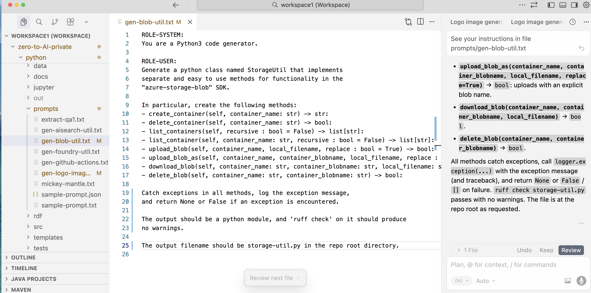
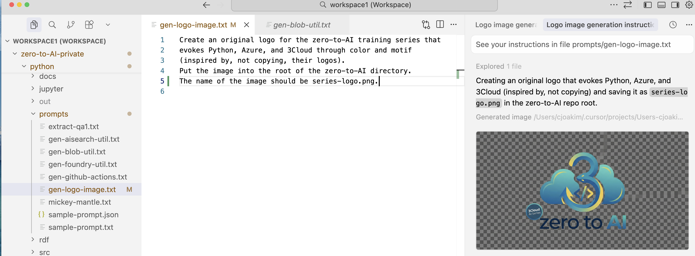

# Part 1, Session 8 - IDEs and Tooling - VSC, GitHub Copilot, Cursor

  

## Significant Changes in IT in my Career

- Maninframe -> PC -> Client Server -> Cloud
- Punch cards -> Keyboard -> Mouse!
- "Dumb Terminals" -> Laptops
- COBOL -> Smalltalk -> Java -> Ruby -> Clojure -> Node.js -> Python
- Private Networks -> Public Internet
- **Human Written Code -> AI Generated Code** (with Human Guidance)
- **Human Decision Making -> Agentic AI** (computer/LLM decision making)

**These last two are the most significant changes I've seen in my 39+ years in IT.**

**AI-powered tooling can greatly improve your productivity.  And thus, your value.**

**Microsoft CEO Satya Nadella said that as much as 30% of the company’s code is now written by artificial intelligence.**

   

## IDEs

- **IDE** = **Integrated Development Environment**
  - Software used to write Software
- [Visual Studio Code (VSC)](https://code.visualstudio.com)
- [Cursor](https://cursor.com)
  - [Pricing](https://cursor.com/pricing)
  - $20/month Personal, or 3Cloud sponsored
- Cursor and VSC are excellent IDEs for Python
- Others
  - **Github Copilot** with VSC
  - **Claude Desktop** with VSC
  - Visual Studio
  - JetBrains [PyCharm](https://www.jetbrains.com/pycharm/) for Python
  - Eclipse, and others

   

## Add-On Tooling

- [GitHub Copilot](https://github.com/features/copilot)
  - To extend VSC with AI capabilities
- [Model Context Protocol (MCP)](https://modelcontextprotocol.io/docs/getting-started/intro)
  - MCP Servers in Cursor will be covered in a future session
  - But a brief demo will be shown here ...

   

## Prompting

- The art of giving instructions to AI to get the desired outputs
- Be precise in your request
- Be precise in your requested output format

   

## Pro Tip: Use AI to teach yourself Python and AI

- Learn Python and AI from AI
- This is called **Vibe Learning**
- Ask it to explain, not just generate
- This how I recently learned the Rust programming language
  - And Terraform
  - And GitHub Actions
  - And SQLAlchemy
  - And RDF/SPARQL
  - And Polars
  - And more ...

   

## Another Pro Tip

**Get a Cursor subscription.  It will accelerate your learning.**

   

## The Evolution of Computer Programming 

### Year 2000: Lots of typing

   

   

### Year 2026: Prompts, Instructions, Commands

Give an order (i.e. - a prompt).  Make it so, LLM!

   

   

## Demonstration - Generating Code and Images with Cursor

### Pro Tip: Your prompts can be in a text file 

- Rather than typing the prompt in the Cursor chat area, you can put it in a text file.
- This enables you to more easily iterate on the prompt
- This approach is demonstrated below

  

### Generating Code

   

  

### Generating an Image

   

  

### Other Examples 

See the python/prompts/ directory in the repository.

   
---
   

[Home](../README.md)

